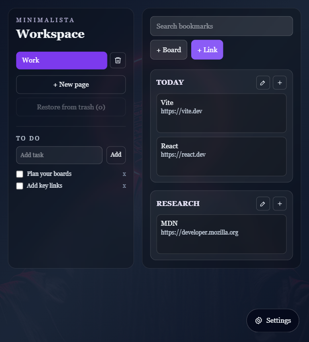

# Minimalista

Minimalista is a clean browser-extension workspace for saving useful links, arranging them into boards, tracking a short to-do list, and personalizing the popup with themes, wallpaper, and accent colors.



## Features

- Save bookmarks with a title, URL, and target board.
- Organize links across pages and draggable boards.
- Move links between boards with drag and drop.
- Restore recently removed links from trash.
- Keep a compact to-do list beside your bookmarks.
- Customize theme, wallpaper, panel visibility, active page color, and link button color.
- Persist user changes with `chrome.storage.local` in the extension and `localStorage` during local development.

## Install As A Browser Extension

1. Install dependencies:

   ```powershell
   npm install
   ```

2. Build the extension:

   ```powershell
   npm run build
   ```

3. Open Chrome or another Chromium-based browser.
4. Go to `chrome://extensions`.
5. Turn on **Developer mode**.
6. Click **Load unpacked**.
7. Select the `dist` folder from this project.
8. Pin **Minimalista** from the extensions menu and open it from the toolbar.

## Development

Run the local app:

```powershell
npm run dev
```

Build production files:

```powershell
npm run build
```

The production extension files are generated in `dist/`.

## How To Use

### Add A Link

1. Click **+ Link**.
2. Enter the bookmark title.
3. Enter the URL.
4. Choose the board.
5. Click **Save**.

### Add Or Rename Boards

- Click **+ Board** to create a new board.
- Click the pencil button on a board to rename it.
- Drag one board over another to reorder boards when board movement is enabled.

### Move Or Remove Links

- Drag a link onto another board to move it.
- Use **Remove** on a link to send it to trash.
- Click **Restore from trash** to bring back the most recently removed link.

### Manage Pages

- Click **+ New page** to create another workspace page.
- Use the page buttons in the sidebar to switch pages.
- Use the trash button beside a page to delete it.

### Customize The UI

1. Click **Settings**.
2. Choose a theme.
3. Toggle board movement.
4. Set panel visibility.
5. Pick active page and link button colors.
6. Choose a wallpaper preset or paste an image URL.

## Project Structure

```text
src/
  App.tsx       Main extension UI and persistence logic
  main.tsx      React entry point
  index.css     Tailwind and global styles
public/
  manifest.json Extension manifest copied into dist
manifest.json   Root manifest reference
```

## Notes

- The extension uses Manifest V3.
- `storage` permission is required so user changes survive popup reloads.
- Remote wallpaper URLs are stored as user settings; custom images must be reachable by the browser.
